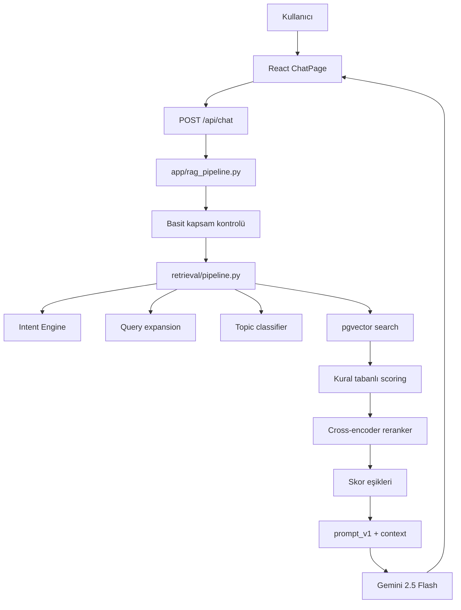
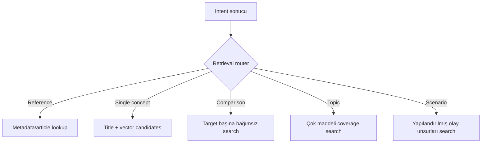
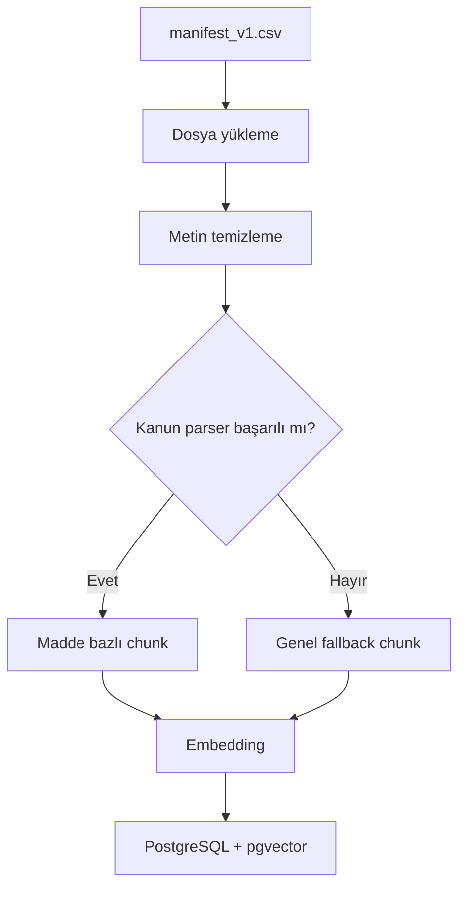
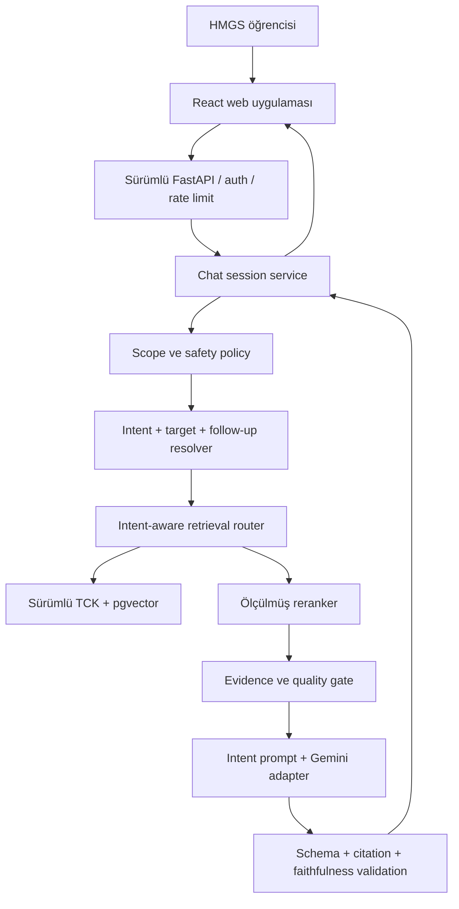
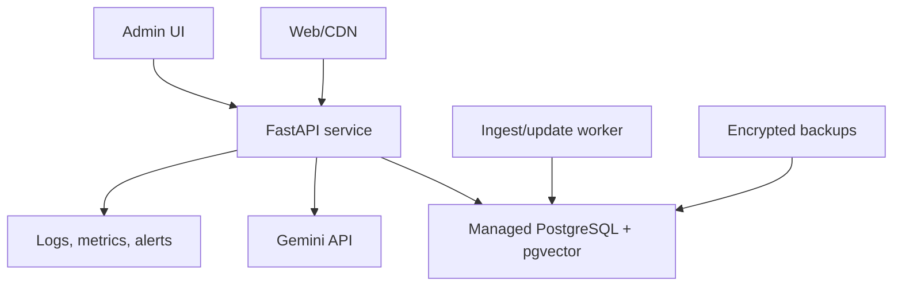

# HMGS Chatbot - Mevcut ve Hedef Mimari

## Belge amacı

Bu belge HMGS Chatbot projesinin:

1. İncelenen arşivdeki mevcut teknik yapısını,
2. Çalışan gerçek chatbot veri akışını,
3. Aktif, yardımcı, deneysel ve legacy parçalarını,
4. Bilinen mimari sorunlarını,
5. Kapalı beta için ulaşılması gereken hedef mimariyi

tanımlar.

Bu belge kod değiştikçe güncellenir. Kod ile belge çelişirse gerçek davranış kod ve
çalışan testlerle doğrulanır; ardından belge aynı görev kapsamında düzeltilir.

## Belge kapsamı

Ana odak piyasaya çıkarılacak TCK tabanlı chatbot sistemidir. Mevcut quiz, dashboard
ve senaryo modülleri mimari bütünlüğü göstermek için belgelenir; ancak chatbot kalite
kapısı geçilene kadar bu modüllerin genişletilmesi ana geliştirme kapsamı değildir.

# 1. Mevcut depo yapısı

İncelenen proje aşağıdaki temel dizinlerden oluşur:

```text
hmgs-ai/
├── analysis/             # Quiz performans ve kullanıcı raporu hesapları
├── app/                  # RAG orkestrasyonu, LLM, quiz ve eski Streamlit UI
├── backend/              # Aktif FastAPI uygulaması ve scenario router
├── data/                 # Eski/örnek veri, import girdileri ve yerel DB
├── docs/                 # Prompt ve eski chatbot akış belgeleri
├── document_parser/      # PDF okuma, temizleme ve kanun ayrıştırma
├── evaluation/           # Retrieval değerlendirme scripti ve vaka seti
├── frontend/             # React/Vite web arayüzü
├── retrieval/            # Intent, search, scoring ve reranking
├── scripts/              # Şema, ingest, seed ve soru üretim scriptleri
├── storage/              # Kaynak TCK PDF'i
├── tests/                # Intent test setleri ve çalıştırıcı
├── schema.sql            # Eski/aktifliği belirsiz PostgreSQL dump şeması
├── full_db.sql           # Veri içeren eski PostgreSQL dump'ı
├── scenario_api.py       # Legacy ayrı FastAPI scenario uygulaması
└── requirements.txt      # Eksik ve sürümleri sabitlenmemiş bağımlılıklar
```

# 2. Mevcut çalışan ürün yüzeyleri

## 2.1. React web uygulaması

Ana giriş:

```text
frontend/src/main.jsx
  -> frontend/src/App.jsx
```

Mevcut sayfalar:

| Sayfa | Dosya | Backend bağlantısı |
|---|---|---|
| Chat | `frontend/src/pages/ChatPage.jsx` | `POST /api/chat` |
| Quiz | `frontend/src/pages/QuizPage.jsx` | Quiz endpoint'leri |
| Senaryo | `frontend/src/pages/ScenarioPage.jsx` | Scenario endpoint'leri |
| Dashboard | `frontend/src/pages/DashboardPage.jsx` | Dashboard endpoint'i |
| Profil | `frontend/src/pages/ProfilePage.jsx` | Profil endpoint'leri |

Genel API istekleri `frontend/src/api.js` içinde toplanmıştır. Ancak Scenario sayfası
API adresini kendi içinde sabit `localhost` olarak tutar. Hedef mimaride bütün API
erişimi tek istemci ve ortam yapılandırmasından geçmelidir.

## 2.2. FastAPI backend

Ana uygulama:

```text
backend/main.py
```

Mevcut endpoint'ler:

| Endpoint | Görev |
|---|---|
| `POST /api/chat` | RAG chatbot cevabı |
| `GET /api/profiles` | Profil listesi |
| `GET /api/profiles/{user_id}` | Profil getirme |
| `POST /api/profiles` | Profil oluşturma/güncelleme |
| `POST /api/quiz/start` | Quiz başlatma |
| `POST /api/quiz/answer` | Cevap gönderme |
| `GET /api/quiz/session/{id}` | Quiz durumu |
| `GET /api/dashboard/{user_id}` | Kullanıcı performans raporu |
| `GET /api/scenarios/` | Aktif senaryolar |
| `GET /api/scenarios/random` | Rastgele senaryo |
| `GET /api/scenarios/{id}` | Senaryo detayı |
| `GET /api/health` | Yüzeysel process health |

Mevcut backend senkron endpoint'ler kullanır. Embedding, cross-encoder, PostgreSQL ve
Gemini işlemleri istek sırasında aynı işlem akışında çalışır.

# 3. Mevcut chatbot veri akışı



## 3.1. API girişi

`backend/main.py` içindeki `/api/chat` endpoint'i yalnızca `question` alanını alır ve
`app.rag_pipeline.run()` fonksiyonunu çağırır.

Mevcut sözleşmede bulunmayan ancak hedefte gerekli alanlar:

- Session ID,
- Kullanıcı kimliği,
- Cevap modu,
- İstemci request ID,
- API sürümü,
- Dil/arayüz tercihi.

## 3.2. RAG orkestrasyonu

Dosya:

```text
app/rag_pipeline.py
```

Sorumlulukları:

1. Soruyu temizlemek,
2. Basit kapsam dışı kontrol yapmak,
3. Retrieval çalıştırmak,
4. Sonuçları `final_score` ile sıralamak,
5. Retrieval kalite eşiklerini uygulamak,
6. Context oluşturmak,
7. Promptu doldurmak,
8. Gemini çağrısı yapmak,
9. Cevap veya fallback döndürmek.

Bu dosya şu anda çok sayıda sorumluluk taşır. Hedefte orkestrasyon korunacak ancak
scope policy, retrieval quality, prompt selection, citation validation ve generation
client ayrı bileşenlere ayrılacaktır.

## 3.3. Basit kapsam kontrolü

Mevcut `is_out_of_scope()` yalnızca birkaç sabit kelimeyi kontrol eder. Bu mekanizma
gerçek alan sınıflandırması değildir ve TCK kapsamında olmayan binlerce soruyu güvenli
biçimde ayıramaz.

Hedefte kapsam kararı aşağıdaki sinyallerle birlikte verilecektir:

- Intent,
- TCK hedef kavram/madde varlığı,
- Retrieval evidence,
- Soru türü,
- Açıklama ihtiyacı,
- Kişisel hukuki danışmanlık sinyali.

## 3.4. Intent Engine

Ana giriş:

```text
retrieval/intent/classifier.py
```

Alt bileşenler:

| Dosya | Görev |
|---|---|
| `normalize.py` | Sorguyu normalize eder |
| `patterns.py` | Comparison, definition, reference kalıpları |
| `signals.py` | Sinyalleri algılar |
| `spans.py` | Reference/relation alanlarını ayırır |
| `candidates.py` | Phrase ve token target adayları üretir |
| `decision.py` | Relation, intent ve scope kararı verir |
| `classifier.py` | Bütün adımları tek sonuçta birleştirir |

Mevcut intent çıktısı:

```json
{
  "intent_type": "comparison",
  "confidence": 0.90,
  "is_reliable": true,
  "targets": [],
  "relation_type": "comparison",
  "scope_level": "structured_comparison",
  "reference_info": {},
  "signals": {}
}
```

Güçlü tarafı, normalize/signal/span/candidate/decision ayrımının modüler olmasıdır.
Mevcut sınırlamalar:

- Confidence değerleri gerçek kalibrasyon yerine büyük ölçüde sabittir.
- Kavram registry'si query expansion listelerine bağlıdır.
- Bazı çoklu tanım soruları tek hedefe düşer.
- Reference intent sınıflandırılır fakat doğrudan reference retrieval'a bağlanmaz.
- Follow-up ve scenario intent'i ürün sözleşmesinde henüz yoktur.

## 3.5. Query expansion

Dosya:

```text
retrieval/query_expansion.py
```

Mevcut expansion alanı yalnızca birkaç kavramı kapsar:

- Hırsızlık,
- Dolandırıcılık,
- Taksir,
- Kast,
- Taşınır mal.

Eklenen terimler ana sorguyla aynı string içine eklenir. Bu durum `taksirle öldürme`
gibi bileşik başlıklarda genel `taksir` maddesini gereğinden fazla güçlendirebilir.

Hedefte expansion:

- Intent ve target farkındalıklı,
- Ana sorgudan ayrı ağırlıklı,
- Açılıp kapanabilir,
- A/B evaluation ile ölçülen,
- Bileşik hukuki ifadeyi koruyan

bir yardımcı bileşen olacaktır.

## 3.6. Topic classifier

Dosya:

```text
retrieval/topic_classifier.py
```

Yalnızca dört konu tanır: hırsızlık, dolandırıcılık, taksir ve kast. Veritabanındaki TCK
belgesinin `konu` değeri `Genel` olduğu için classifier'ın ürettiği topic boost çoğu
adayda uygulanmaz.

Hedef karar:

- Metadata taksonomisiyle uyumlu ve ölçülmüş faydası olacak şekilde yeniden tasarlanır,
  veya
- Ablation testinde fayda sağlamıyorsa aktif retrieval akışından kaldırılır.

## 3.7. Embedding

Dosya:

```text
retrieval/embedding_model.py
```

Model lazy singleton olarak yüklenir. Model adı environment üzerinden seçilebilir.
Projede farklı dosyalarda iki model adı görülmüştür:

- `sentence-transformers/paraphrase-multilingual-MiniLM-L12-v2`
- `sentence-transformers/all-MiniLM-L6-v2`

İkisi de 384 boyut üretse bile aynı embedding uzayı değildir. Mevcut şema indeksin
hangi modelle üretildiğini zorunlu olarak doğrulamaz.

Hedefte embedding registry şu bilgileri tutar:

- Provider/model,
- Model sürümü,
- Vektör boyutu,
- Normalize ayarı,
- Chunking sürümü,
- İndeks oluşturulma zamanı,
- Aktif indeks durumu.

## 3.8. Vector search

Dosya:

```text
retrieval/vector_search.py
```

Mevcut sorgu:

- Soru embedding'i üretir,
- `document_chunks.embedding` üzerinde cosine distance kullanır,
- İlk `fetch_k` adayı getirir,
- Document metadata ile birleştirir.

Mevcut search bütün intent türleri için aynı yolu kullanır. Açık madde referansı bile
semantic search'e gider.

Hedefte retrieval router kullanılacaktır:



## 3.9. Kural tabanlı scoring

Dosya:

```text
retrieval/scoring.py
```

Mevcut final skor bileşenleri:

- Vector similarity,
- Topic boost,
- Lexical overlap,
- Title match,
- Exact title bonus,
- Phrase match,
- Target presence,
- Search-target match,
- Lexical boost,
- Comparison penalty.

Aynı lexical sinyal birden fazla bileşen tarafından ödüllendirilebilir. Final skor
olasılık değildir ve 1.0 değerini aşabilir. Buna rağmen sonraki katmanda confidence
benzeri eşik olarak kullanılmaktadır.

Hedefte her skor bileşeni:

- Unit test,
- Ablation testi,
- Soru türü bazında fayda,
- Açıklanabilir görev

ile gerekçelendirilmelidir.

## 3.10. Reranker

Dosya:

```text
retrieval/reranker.py
```

Model:

```text
cross-encoder/mmarco-mMiniLMv2-L12-H384-v1
```

Mevcut entegrasyonda iki kritik problem vardır:

1. Guardrail `rerank_score` yerine eski `score` alanını okumaktadır.
2. `app/rag_pipeline.py`, reranker sırasını tekrar `final_score` ile sıralayarak bozar.

Sonuç olarak reranker hesaplama maliyeti oluşturmasına rağmen nihai context sırasına
beklenen şekilde etki etmez.

Hedef akış:

```text
Candidate generation
  -> deterministic filters
  -> pre-rerank feature score
  -> reranker
  -> post-rerank guardrails
  -> diversity/deduplication
  -> context selection
```

Reranker yalnızca A/B evaluation sonucunda kaliteyi yeterli ölçüde iyileştirirse aktif
kalacaktır.

## 3.11. Retrieval kalite kontrolü

Mevcut eşikler:

- `MIN_SCORE`,
- `MIN_TOP_SCORE`,
- `MIN_SECOND_SCORE`,
- `MIN_AVG_TOP3_SCORE`,
- `AMBIGUITY_MARGIN`.

Bu eşikler elle belirlenmiş birleşik skorlara bağlıdır. Hedefte intent'e özel threshold
kalibrasyonu evaluation veri seti üzerinde yapılacak; false answer ve false refusal
ayrı izlenecektir.

## 3.12. Context oluşturma

Mevcut context formatı:

```text
[doc_id | title]
chunk content
```

Context'e en fazla seçilmiş sonuçlar girer ancak token bütçesi, madde coverage ve
claim-citation ilişkisi açık yönetilmez.

Hedef context item şeması:

```json
{
  "source_id": "tck",
  "source_version": "...",
  "article_number": "141",
  "article_title": "Hırsızlık",
  "unit_type": "article",
  "content": "...",
  "retrieval_reason": "comparison_target_1",
  "scores": {}
}
```

## 3.13. Prompt ve Gemini

Mevcut prompt:

```text
docs/prompt_v1.md
```

Mevcut model istemcisi:

```text
app/llm/gemini_client.py
```

Model adı kodda sabittir:

```text
gemini-2.5-flash
```

Mevcut prompt yalnızca bağlamı kullanma konusunda iyi bir başlangıçtır. Ancak bütün
intent türleri aynı promptu kullanır ve çıktı serbest metindir.

Mevcut hata problemi:

- Gemini client hata yakalayıp `LLM hata verdi.` metni döndürür.
- Üst katman bu metni uzunluğu yeterli olduğu için başarılı cevap sayabilir.

Hedef generation katmanı:

- Intent'e özel prompt,
- Sürümlü prompt registry,
- Yapılandırılmış çıktı,
- Timeout ve sınırlı retry,
- Model/provider adaptörü,
- Citation validator,
- Faithfulness kontrolü,
- Güvenli no-answer/fallback

içerecektir.

# 4. Mevcut belge ingest akışı

Ana script:

```text
scripts/ingest_documents.py
```

Mevcut akış:



Mevcut kaynak manifestinde yalnızca TCK bulunur. Bu, ilk ürün kapsamıyla uyumludur.

Güçlü taraflar:

- Manifest tabanlı ingest,
- File hash,
- Madde parser fallback'i,
- Metadata üretimi,
- Belge update/upsert davranışı.

Eksikler:

- Kanonik belge sürüm tablosu yok,
- Embedding model uyumluluk kontrolü yok,
- Onaylı güncelleme akışı yok,
- Parser/chunking sürümü yok,
- Başarısız ingest için açık staging/rollback modeli yok,
- Birden fazla şema scripti var.

# 5. Mevcut veri katmanı

## 5.1. PostgreSQL bağlantıları

Bağlantı oluşturma birkaç dosyada tekrar edilir:

- `analysis/db.py`,
- `app/sqlstorage.py`,
- `app/scenario_storage.py`,
- Repository dosyaları,
- Scriptler.

Hedefte:

- Merkezi settings,
- Merkezi pool,
- Request/job yaşam döngüsü,
- Migration ile yönetilen şema,
- Test DB fixture'ı

kullanılacaktır.

## 5.2. Şema çakışmaları

Mevcut şema kaynakları:

- `schema.sql`,
- `full_db.sql`,
- `scripts/create_*_table.py`,
- `app/sqlstorage.init_storage()`,
- `app/scenario_storage.init_scenario_storage()`.

Özellikle `questions` ve `quiz_attempt_answers` alanları farklı kaynaklarda farklıdır.
`CREATE TABLE IF NOT EXISTS` eski tabloyu yeni şemaya dönüştürmez.

Hedefte tek şema kaynağı Alembic migration dosyaları olacaktır. Uygulama request
sırasında şema oluşturmayacaktır.

# 6. Mevcut test ve evaluation mimarisi

## 6.1. Intent testleri

Dosyalar:

```text
tests/intent/test_cases.py
tests/intent/test_cases_v2.py
tests/intent/test_cases_v3.py
tests/intent/test_cases_v4.py
tests/intent/test_cases_v5.py
tests/intent/run_tests.py
```

Mevcut test runner v4 için v2'yi, v5 için v3'ü yüklemektedir. Gerçek dosyalar doğrudan
çalıştırıldığında başlangıç gözlemi:

| Set | Sonuç |
|---|---:|
| v1 | 60/60 |
| v2 | 60/60 |
| v3 | 60/60 |
| v4 | 60/60 |
| v5 gerçek dosya | 45/60 |
| Toplam | 285/300 |

Bu değer kanonik baseline değildir; F1-05 sırasında kontrollü ortamla yeniden
üretilip `TEST_RESULTS.md` içine yazılacaktır.

## 6.2. Retrieval evaluation

Dosyalar:

```text
evaluation/test_questions.py
evaluation/run_retrieval_eval.py
evaluation/eval_output.txt
```

Kayıtlı çıktı:

- Toplam 40 soru,
- 22 doğru,
- %55 genel accuracy.

Grup gözlemi:

| Grup | Sonuç |
|---|---:|
| Single article | 22/27 |
| Comparison | 0/5 |
| Concept | 0/6 |
| Other | 0/2 |

Comparison ve concept vakalarının `uncertain` olarak modellenmesi ürün hedefiyle
uyumlu değildir. Hedef evaluation çoklu gerekli maddeleri ve answer/no-answer kararını
ayrı ölçer.

# 7. Mevcut destek modülleri

## 7.1. Quiz ve analiz

Aktif parçalar:

- `app/question_select.py`,
- `app/quiz_engine.py`,
- `app/repositories/questions_repo.py`,
- `analysis/quizanalysis.py`,
- `analysis/user_report.py`,
- `analysis/rank_topics.py`,
- `analysis/suggestions.py`.

Bu modüller chatbot ürünleştirme kritik yolunda değildir. Şema migration'ları yapılırken
veri kaybı yaşamamaları gerekir; yeni özellik geliştirilmez.

## 7.2. Senaryo modülü

Aktif router:

```text
backend/scenarios.py
  -> app/scenario_storage.py
```

Legacy ayrı uygulama:

```text
scenario_api.py
```

Legacy uygulama sabit DB bağlantı bilgileri ve geniş CORS içerir. Aktif ürün mimarisine
dahil edilmemelidir.

## 7.3. Streamlit

Mevcut Streamlit dosyaları eski UI yaklaşımıdır:

- `app/streamlit_app.py`,
- `app/ui/chat_page.py`,
- `app/ui/quiz_page.py`,
- `app/ui/dashboard_page.py`.

Piyasaya çıkacak web ürünü React + FastAPI olacaktır. Streamlit'in aktif ürün yolu
olmadığı karar kaydına bağlanmalıdır.

# 8. Mevcut mimari risk özeti

| Risk | Etki | Hedef görev |
|---|---|---|
| Gerçek API anahtarı örnek dosyada | Kritik güvenlik | F0-01 |
| Temiz kurulum bozuk | Geliştirme/yayın | F0-03, F0-04 |
| v4/v5 yanlış test importu | Yanlış kalite algısı | F1-01 |
| Retrieval evaluation yanlış modeli | Yanlış optimizasyon | F1-03 |
| Birden fazla şema kaynağı | Veri kaybı/runtime hata | F2 |
| Embedding model uyumsuzluğu | Sessiz retrieval bozulması | F2-04 |
| Reference intent semantic search'e gidiyor | Yanlış madde | F5-01 |
| Query expansion bileşik ifadeyi bozuyor | Yanlış retrieval | F5-06 |
| Topic classifier metadata ile uyumsuz | Etkisiz karmaşıklık | F6-02 |
| Reranker skoru yanlış kullanılıyor | Kalite ve gecikme | F6-01 |
| Reranker sırası tekrar bozuluyor | Reranker fiilen etkisiz | F6-01 |
| Elle belirlenmiş eşikler | Yanlış cevap/refusal | F6-04 |
| Tek prompt bütün intent'lerde | Düzensiz cevap | F7-01 |
| LLM hata metni answer sayılıyor | Kullanıcıya hatalı çıktı | F7-04 |
| Citation validation yok | Uydurma madde riski | F7-03 |
| Conversation state yok | Takip soruları başarısız | F8 |
| Quiz session RAM'de | Ölçekleme/veri kaybı | Chatbot dışı/sonraki karar |
| Auth yok | Veri izolasyonu | F9 |
| Yüzeysel health endpoint | Operasyon riski | F9-05 |
| Merkezi logging/trace yok | Hata teşhisi | F12 |

# 9. Hedef ürün mimarisi



## 9.1. Hedef backend modülleri

Önerilen kavramsal yapı:

```text
backend/
├── api/v1/                 # Sürümlü endpoint'ler
├── auth/                   # Hesap, token ve yetkilendirme
├── chat/                   # Session/message uygulama servisi
├── core/                   # Settings, logging, errors, security
├── db/                     # Pool, models, repositories, migrations
├── legal_sources/          # TCK sürüm ve update yönetimi
├── rag/
│   ├── intent/             # Intent ve target çözümleme
│   ├── retrieval/          # Router ve stratejiler
│   ├── ranking/            # Feature score ve reranker
│   ├── evidence/           # Coverage ve cevap verme kararı
│   ├── generation/         # Prompt ve model adaptörleri
│   └── validation/         # Citation ve faithfulness
├── feedback/               # Kullanıcı geri bildirimi
└── admin/                  # Operasyon ve kalite görünümü
```

Bu hedef bir kerede büyük klasör taşıması yapmak için kullanılmaz. Her görev kendi
sorumluluğunu ayırdıkça modüller kademeli taşınır ve import regression testleriyle
doğrulanır.

## 9.2. Hedef chatbot request akışı

1. API request doğrulanır.
2. Auth, rate limit ve session sahipliği kontrol edilir.
3. Kullanıcı mesajı güvenli biçimde kaydedilir.
4. Conversation state yüklenir.
5. Scope/safety sinyalleri çıkarılır.
6. Intent, target, reference ve cevap modu çözülür.
7. Düşük güven varsa açıklama sorulur.
8. Intent-aware retrieval stratejisi seçilir.
9. Aday kaynaklar getirilir.
10. Deterministik filtre, rerank, diversity ve coverage uygulanır.
11. Evidence quality gate cevap verilip verilmeyeceğine karar verir.
12. Intent'e özel prompt ve yapılandırılmış context oluşturulur.
13. Gemini adapter timeout/retry politikasıyla çağrılır.
14. Çıktı şeması doğrulanır.
15. Her citation retrieval evidence ile doğrulanır.
16. Desteksiz iddia varsa cevap reddedilir veya kontrollü yeniden üretim yapılır.
17. Cevap, kaynak sürümü ve teknik metadata kaydedilir.
18. Güvenli kullanıcı cevabı döndürülür.
19. Latency, hata ve maliyet metrikleri anonim biçimde kaydedilir.

# 10. Hedef veri modeli sınırları

## Hukuki kaynak katmanı

- `legal_sources`: TCK gibi kaynak kimliği.
- `legal_document_versions`: İndirilen/onaylanan kaynak sürümleri.
- `legal_units`: Madde, fıkra ve bent hiyerarşisi.
- `legal_chunks`: Retrieval birimleri.
- `embedding_indexes`: Model ve chunking sürüm bilgisi.

## Chat katmanı

- `users`,
- `chat_sessions`,
- `chat_messages`,
- `chat_message_sources`,
- `chat_feedback`.

## Kalite ve operasyon

- `evaluation_cases`,
- `evaluation_runs`,
- `evaluation_results`,
- `law_update_candidates`,
- `ingestion_jobs`,
- `admin_audit_events`.

Detaylı şema F2 görevleri sırasında tasarlanacak; bu belge tablo kolonlarının nihai
kaynağı değildir.

# 11. Hedef güven ve cevap verme modeli

Tek bir birleşik `final_score` hukuki cevap güveni olarak kullanılmayacaktır.

Karar katmanları ayrı tutulur:

1. Intent güveni,
2. Target/reference güveni,
3. Retrieval coverage,
4. Kaynak uygunluğu,
5. Rerank sıralama sinyali,
6. Cevap verilebilirlik,
7. Generation schema doğruluğu,
8. Citation doğruluğu,
9. Faithfulness.

Her katmanın başarısızlık nedeni kullanıcıya teknik skor göstermeden reason code olarak
kaydedilir.

# 12. Hedef gözlemlenebilirlik

Her chatbot isteğinde hassas metin kaydetmeden aşağıdakiler izlenebilir olmalıdır:

- Request ID,
- Kullanıcı/session için anonim kimlik,
- Intent ve güven sınıfı,
- Retrieval stratejisi,
- Kaynak madde numaraları,
- Embedding/index sürümü,
- Prompt/model sürümü,
- Intent, embedding, DB, rerank ve LLM süreleri,
- Answer/no-answer nedeni,
- Citation validation sonucu,
- Token ve maliyet tahmini,
- Hata sınıfı.

# 13. Hedef deployment topolojisi

Beta sağlayıcısı F13-01'de seçilecektir. Sağlayıcıdan bağımsız mantıksal bileşenler:



Zorunlu özellikler:

- Staging ve production ayrımı,
- Secret yönetimi,
- TLS,
- Otomatik backup,
- Restore testi,
- Health/readiness,
- Merkezi log ve alarm,
- Uygulama/TCK/prompt/model rollback.

# 14. Mimari karar ilkeleri

Yeni bir teknik karar aşağıdaki ölçütlerle değerlendirilir:

1. TCK dışındaki gelecekteki HMGS kaynaklarını engelliyor mu?
2. Test edilebilir ve gözlemlenebilir mi?
3. Veri veya model sürümü izlenebilir mi?
4. Hukuki kaynak dışı üretim riskini azaltıyor mu?
5. Failure ve rollback davranışı tanımlı mı?
6. Tek soruya özel geçici kural mı, genel çözüm mü?
7. Performans ve maliyet etkisi ölçülebilir mi?
8. İki kişilik ekip tarafından sürdürülebilir mi?

Karar mimariyi veya ürün kapsamını değiştiriyorsa `DECISIONS.md` içinde ADR benzeri
bir kayıt oluşturulur.

# 15. Mimari geçiş stratejisi

Mevcut sistem bir kerede yeniden yazılmayacaktır. Strangler yaklaşımına benzer kademeli
geçiş uygulanır:

1. Önce test ve baseline kurulur.
2. Yeni sözleşmeler mevcut davranışın etrafına eklenir.
3. Reference retrieval gibi bağımsız stratejiler tek tek değiştirilir.
4. Her değişiklik eski sistemle karşılaştırılır.
5. Yeni bileşen kalite kapısını geçince aktif olur.
6. Kullanılmayan legacy yol daha sonra kaldırılır.

Bu yaklaşım, aynı anda bütün sistemi değiştirip hatanın kaynağını belirsiz hale getirmeyi
önler.

# 16. Bu belgenin güncelleme kuralı

Şu değişikliklerden biri yapıldığında `ARCHITECTURE.md` aynı görevde güncellenmelidir:

- Chatbot request akışı değişirse,
- Yeni aktif servis veya repository eklenirse,
- Aktif/legacy dosya durumu değişirse,
- Veri şeması veya migration yaklaşımı değişirse,
- Model, embedding veya reranker sözleşmesi değişirse,
- API sürümü veya endpoint yapısı değişirse,
- Deployment topolojisi seçilirse,
- Güvenlik veya veri yaşam döngüsü kararı değişirse.
